# ServiceNow ITSM Help Desk Lab

**Platform:** ServiceNow Personal Developer Instance (dev425764)  
**Instance Version:** Australia (Latest Release)  
**Status:** Complete ✅

---

## Project Overview

This lab documents the setup and use of a ServiceNow Personal Developer Instance (PDI) to simulate a real enterprise IT help desk environment. Three Tier 1 incident tickets were created and resolved from start to finish, demonstrating the full ITSM ticket lifecycle — from caller intake to resolution documentation and ticket closure.

ServiceNow is the most widely used IT Service Management (ITSM) platform in the world, deployed by Fortune 500 companies, government agencies, and managed service providers.

---

## Lab Walkthrough — Step by Step

### Phase 1 — Account Setup and Instance Provisioning

**Step 1 — Email Verification**  
Created a free ServiceNow Developer account at developer.servicenow.com and verified the email address.

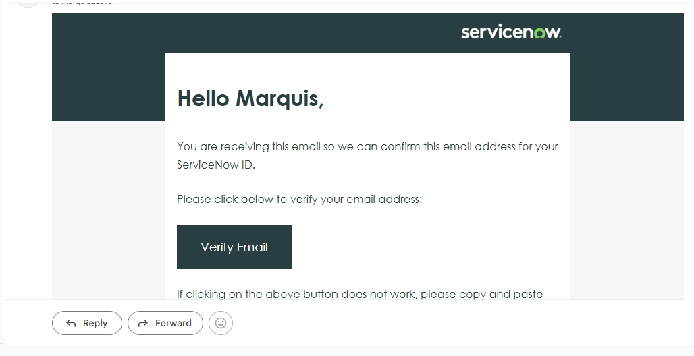

---

**Step 2 — PDI Provisioning Request**  
Submitted a request for a Personal Developer Instance (PDI). ServiceNow builds a fully functional, private cloud-hosted instance for each developer.

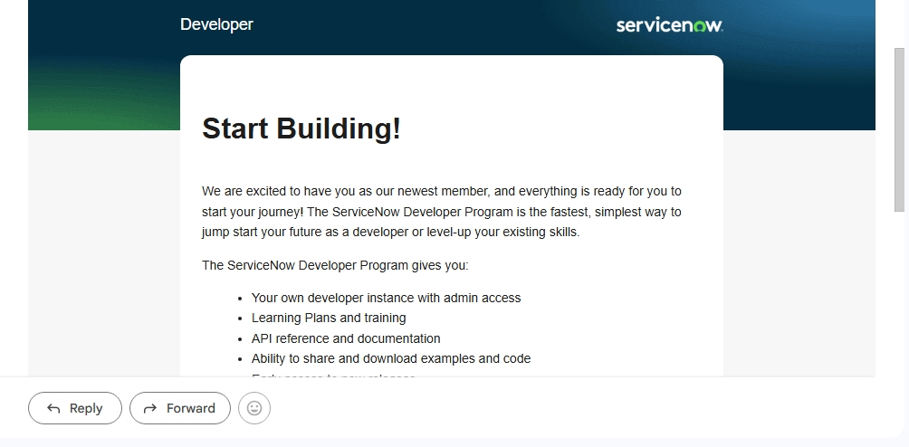

---

**Step 3 — Welcome Email**  
Received the ServiceNow Developer Program welcome email confirming account activation.

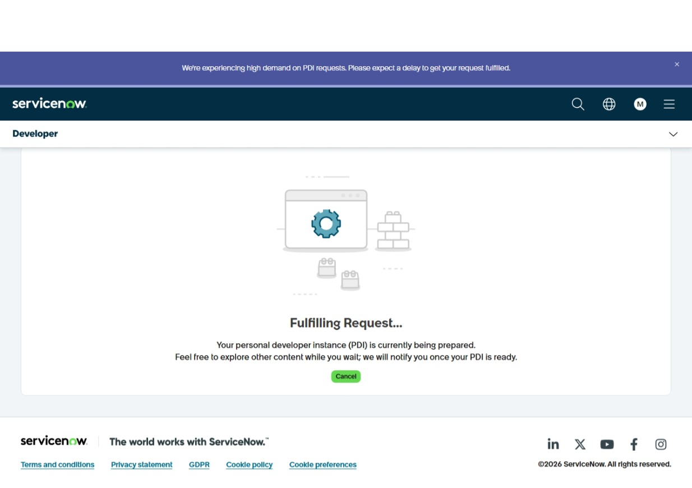

---

**Step 4 — PDI Ready Email**  
Received email notification that the Personal Developer Instance was provisioned and ready to use.

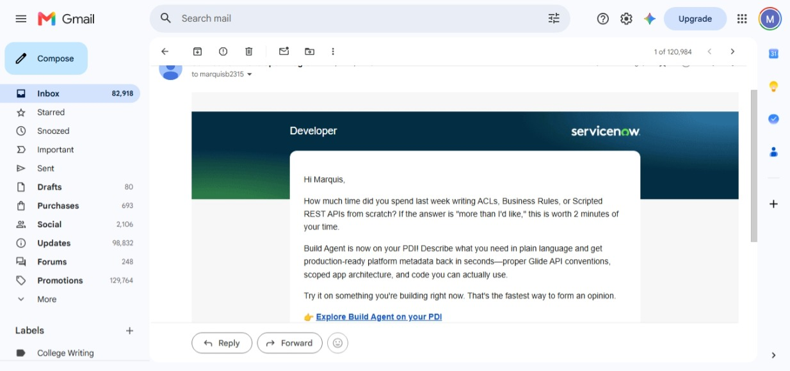

---

**Step 5 — PDI Online Dashboard**  
Logged into the ServiceNow Developer portal. Instance dev425764 showing status: Online, running the Australia (Latest Release) version.

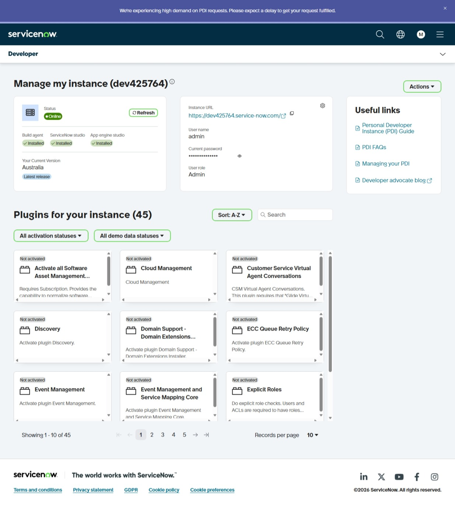

---

### Phase 2 — Instance Login and Navigation

**Step 6 — ServiceNow Homepage**  
Successfully logged into the live ServiceNow instance as Admin. This is the central ITSM platform dashboard.

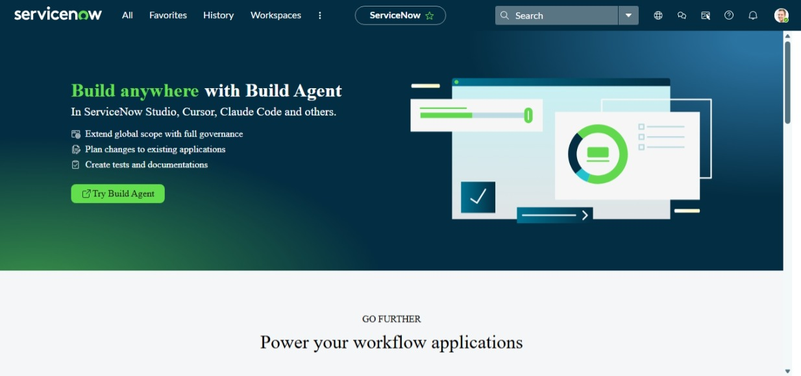

---

**Step 7 — Incident Module Navigation**  
Used the Application Navigator (All menu) to locate the Incident module and opened a new incident form.

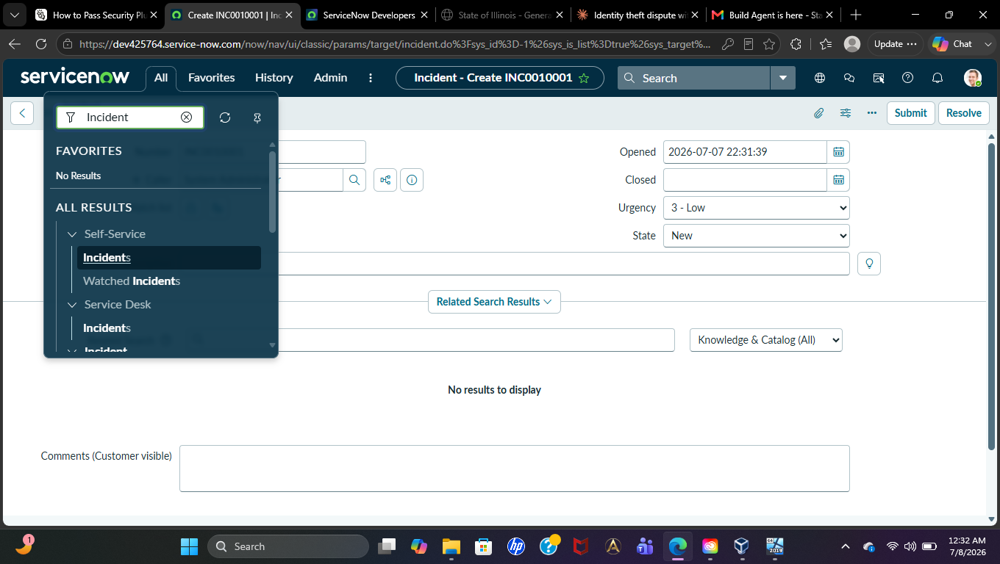

---

### Phase 3 — Ticket 1: Locked Out Account (INC0010007)

**Scenario:** User David Miller called the help desk — unable to log in due to account lockout after multiple failed password attempts.

**Step 8 — Ticket 1 Open**  
Created incident INC0010007 with caller David Miller, Short Description: "User account locked out — unable to log in to domain."

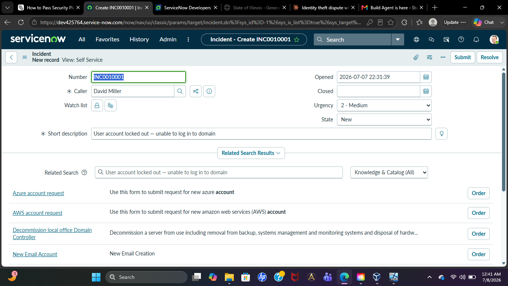

---

**Step 9 — Resolution Information**  
Filled in the Resolution Information tab: Resolution Code set to "Solution provided" and Resolution Notes documenting the action taken.

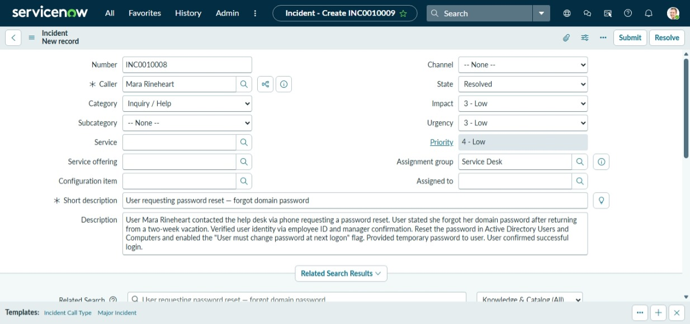

---

**Step 10 — Ticket 1 Resolved**  
INC0010007 successfully resolved. Blue confirmation banner: "INC0010007 has been resolved."

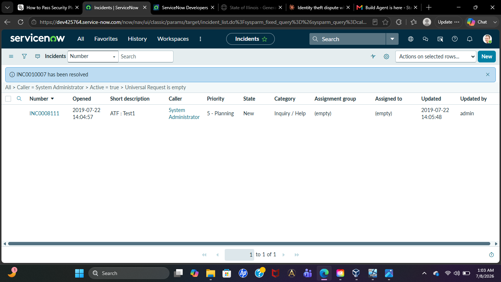

---

### Phase 4 — Ticket 2: Password Reset (INC0010008)

**Scenario:** User Marcus Williams forgot his domain password after a two-week vacation and requested a reset.

**Step 11 — Ticket 2 Open**  
Created incident INC0010008 with caller Marcus Williams, Short Description: "User requesting password reset — forgot domain password."

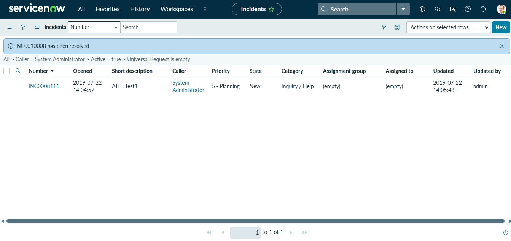

---

**Step 12 — Ticket 2 Resolved**  
INC0010008 successfully resolved. Resolution Notes: "Password reset in Active Directory. User must change password at next logon flag enabled."

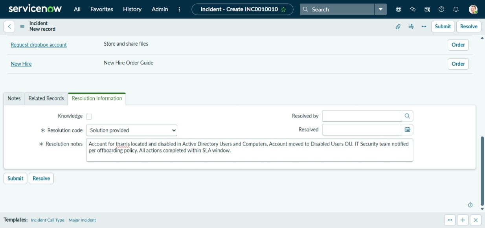

---

### Phase 5 — Ticket 3: Terminated Employee Account Disable (INC0010010)

**Scenario:** HR Manager Sarah Johnson submitted an urgent request to disable the account of terminated employee Thomas Harris (tharris). Per security policy, access must be revoked within one hour of termination.

**Step 13 — Ticket 3 Resolved**  
INC0010010 successfully resolved. Priority set to High. Resolution Notes: "Account for tharris located and disabled in Active Directory. Account moved to Disabled Users OU. IT Security team notified per offboarding policy. All actions completed within SLA window."

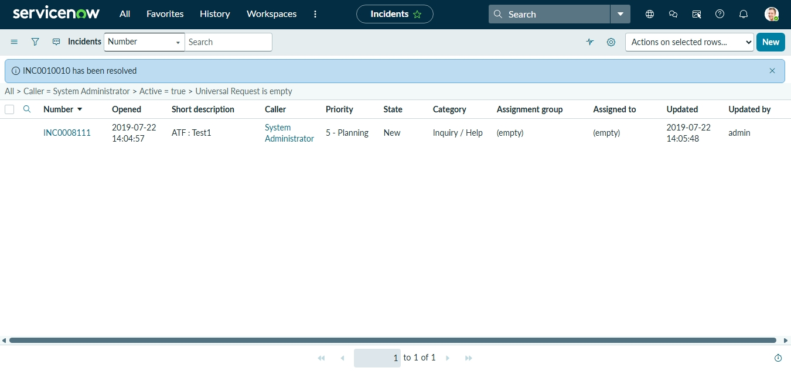

---

## Ticket Summary

| Ticket | Scenario | Priority | Resolution |
|--------|----------|----------|-----------|
| INC0010007 | Locked Out Account — David Miller | Medium | Account unlocked in Active Directory ✅ |
| INC0010008 | Password Reset — Marcus Williams | Low | Password reset, must change at next logon ✅ |
| INC0010010 | Terminated Employee — Thomas Harris | **High** | Account disabled and moved to Disabled OU ✅ |

---

## Key Concepts Demonstrated

| Concept | Application |
|---------|------------|
| Ticket Lifecycle | Created, updated, and resolved all tickets from open to closed |
| Caller Verification | Documented identity verification before taking action |
| Resolution Documentation | Filled in Resolution Code and Resolution Notes on every ticket |
| SLA Awareness | Ticket 3 treated as Priority 1 with time-sensitive resolution |
| Security-Aware Offboarding | Followed proper access revocation procedures for terminated employee |
| ITSM Workflow | Navigated Application Navigator, Incident module, and Resolution Information tab |

---

## Connection to Active Directory Lab

The three scenarios in this lab are directly linked to the [Active Directory Home Lab](https://github.com/Marquisb2170506/active-directory-home-lab). The same tasks performed in Active Directory (account unlock, password reset, account disable) are now formally documented as ServiceNow incident tickets — demonstrating the complete IT support workflow from the technical action in AD to the business record in the ticketing system.

---

## Contact

**Marquis Borney**  
Email: marquisb.2315@gmail.com  
Location: St. Louis, MO (Open to Remote)  
LinkedIn: [linkedin.com/in/marquis-borney-717326102](https://www.linkedin.com/in/marquis-borney-717326102)
